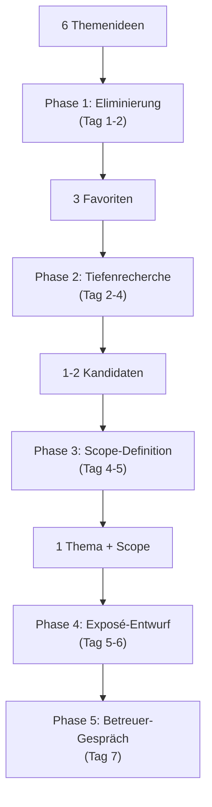

# Themenfindung & Scope-Entwicklung – Projektarbeit (PA)

> Ziel: Innerhalb einer Woche (29.04. – 05.05.2026) ein klar definiertes PA-Thema mit abgestecktem Scope festlegen, das idealerweise auch als Grundlage für die Bachelorarbeit dient.

## Rahmenbedingungen (aus den Dokumenten)

| Parameter | Wert |
|---|---|
| Netto-Bearbeitungszeit PA | 4 Wochen (Vollzeit) |
| Brutto-Bearbeitungszeitraum | max. 3 Monate |
| Seitenumfang (1 Bearbeiter) | ca. 15–25 Seiten (reiner Text) |
| PA-BA-Kopplung | Empfohlen (PA = Konzept, BA = Realisierung) |
| Bewertung | Inhalt, Wissenschaftlichkeit, Selbstständigkeit, Kreativität, Darstellung |

> [!IMPORTANT]
> Die PA sollte idealerweise **konzeptionell** angelegt sein, damit die BA die **Realisierung/Auswertung** übernehmen kann. Das beeinflusst den Scope massiv.

---

## Deine 6 Themenideen – Übersicht & Erstbewertung

Ich habe deine Ideen in eine strukturierte Matrix überführt. Die Bewertung erfolgt entlang von 6 Kriterien, die für die PA-Entscheidung relevant sind:

| # | Thema | Kürzel |
|---|---|---|
| T1 | **15-Minuten-Stadt** – Automatisiertes Planungstool (Valhalla + OSM) | `15MIN` |
| T2 | **Mikroklima-Karte Würzburg** – Temperaturinterpolation (SENSOTO-Daten) | `MIKRO` |
| T3 | **Hitze-Gefahren-Karte DE** – Wetbulb-Temp, Trinkstationen, Parks etc. | `HITZE` |
| T4 | **Klimadashboard** – Regionales Dashboard (à la klimadashboard.de) | `KLIMA` |
| T5 | **Skyfall-GS** – Schrägluftaufnahmen Würzburg (5cm DOP) | `SKYFALL` |
| T6 | **Gaussian Splatting vs. Punktwolke** – Vergleichsstudie 3D-Rekonstruktion | `GAUSS` |

### Bewertungsmatrix

| Kriterium | T1 `15MIN` | T2 `MIKRO` | T3 `HITZE` | T4 `KLIMA` | T5 `SKYFALL` | T6 `GAUSS` |
|---|:---:|:---:|:---:|:---:|:---:|:---:|
| **Interessenabdeckung** (Geo, KI, CV, FE, AppDev) | ⭐⭐⭐ | ⭐⭐ | ⭐⭐⭐ | ⭐⭐ | ⭐⭐⭐⭐ | ⭐⭐⭐⭐⭐ |
| **Datenverfügbarkeit** | ⭐⭐⭐⭐⭐ | ⭐⭐⭐ | ⭐⭐⭐ | ⭐⭐⭐ | ⭐⭐ | ⭐⭐⭐ |
| **Scope-Kontrollierbarkeit** (für 4 Wochen PA) | ⭐⭐⭐⭐ | ⭐⭐⭐ | ⭐⭐ | ⭐⭐⭐ | ⭐⭐⭐ | ⭐⭐⭐⭐ |
| **PA-BA-Kopplung** (Konzept → Realisierung) | ⭐⭐⭐⭐⭐ | ⭐⭐⭐⭐ | ⭐⭐⭐⭐ | ⭐⭐⭐⭐ | ⭐⭐⭐⭐⭐ | ⭐⭐⭐⭐⭐ |
| **Wissenschaftliche Tiefe** | ⭐⭐⭐ | ⭐⭐⭐⭐ | ⭐⭐⭐⭐ | ⭐⭐⭐ | ⭐⭐⭐⭐⭐ | ⭐⭐⭐⭐⭐ |
| **Gesellschaftliche Relevanz / Aktualität** | ⭐⭐⭐⭐⭐ | ⭐⭐⭐⭐⭐ | ⭐⭐⭐⭐⭐ | ⭐⭐⭐⭐ | ⭐⭐⭐ | ⭐⭐⭐⭐ |

### Kurzbewertung je Thema

#### T1 – 15-Minuten-Stadt `15MIN`
- **Stärken:** Exzellente Datenverfügbarkeit (OSM + Valhalla = FOSS), sehr gute PA-BA-Kopplung (PA = Konzept/Methodik, BA = Implementierung des Tools), hohe gesellschaftliche Relevanz
- **Risiken:** Routing-Berechnungen auf 25m-Raster können rechenintensiv werden; Windrose-Visualisierung erfordert klare Definition
- **PA-Scope-Idee:** Konzeptioneller Entwurf der Methodik, Datenmodell, UX-Mockups, Proof-of-Concept für ein Teilgebiet
- **BA-Scope-Idee:** Vollständige Implementierung, Skalierung, Validierung mit Kommunen

#### T2 – Mikroklima Würzburg `MIKRO`
- **Stärken:** Lokaler Bezug zu Würzburg, Kombination aus Sensorik und GIS, Klimarelevanz
- **Risiken:** Datenverfügbarkeit der SENSOTO-Sensoren prüfen; Interpolationsmethodik kann komplex werden
- **PA-Scope-Idee:** State-of-the-Art-Analyse der Interpolationsverfahren, Konzeptentwicklung, Datenakquise-Plan
- **BA-Scope-Idee:** Implementierung der Interpolation, Web-Karte, Validierung

#### T3 – Hitze-Gefahren-Karte DE `HITZE`
- **Stärken:** Topaktuell (Klimawandel), multi-variater Ansatz, viele Datenquellen
- **Risiken:** **Scope-Explosion!** Wetbulb-Temp + Trinkstationen + med. Versorgung + Parks + Naherholung = zu viele Dimensionen für eine PA. Schwierige bundesweite Datenlage
- **PA-Scope-Idee:** Konzept + Fokus auf 1-2 Indikatoren für eine Pilotregion
- **BA-Scope-Idee:** Erweiterung auf alle Indikatoren + größeren Raum

> [!WARNING]
> T3 hat das höchste Risiko einer Scope-Explosion. Falls dieses Thema gewählt wird, muss der Scope **radikal** eingegrenzt werden (z.B. nur Wetbulb + Trinkstationen, nur für Bayern).

#### T4 – Klimadashboard `KLIMA`
- **Stärken:** Orientierung an existierendem Produkt (klimadashboard.de), klare Zielgruppe
- **Risiken:** Abgrenzung zu existierenden Dashboards unklar; Wissenschaftliche Eigenleistung muss herausgearbeitet werden
- **PA-Scope-Idee:** Anforderungsanalyse, Konzept, Datenmodell, Prototyp-Mockups
- **BA-Scope-Idee:** Implementierung des Dashboards

#### T5 – Skyfall-GS Schrägluftaufnahmen `SKYFALL`
- **Stärken:** Hervorragende PA-BA-Kopplung, hochauflösende Daten (5cm), passt exzellent zu Prof. Müller's Themenbereich (CV, Photogrammetrie, UAV), du hast bereits Paper dazu gesammelt
- **Risiken:** Datenverfügbarkeit klären (Zugang zu den Skyfall-GS-Daten?), Hardware-/Software-Anforderungen
- **PA-Scope-Idee:** Verfahrensvergleich (Konzept), Qualitätskriterien definieren, Testdatensatz vorbereiten
- **BA-Scope-Idee:** Durchführung der Rekonstruktion, quantitative Auswertung

#### T6 – Gaussian Splatting vs. Punktwolke `GAUSS`
- **Stärken:** **Höchste Interessenabdeckung** (KI, CV, Fernerkundung, Geoinformatik), exzellente wissenschaftliche Tiefe, sehr gute PA-BA-Kopplung, passt perfekt zu den angebotenen Themen von Prof. Müller
- **Risiken:** Rechenleistung für Gaussian Splatting; Vergleichskriterien müssen klar definiert werden
- **PA-Scope-Idee:** Systematischer Literaturreview, Kriterienkatalog (Geometrische Genauigkeit, Objekterkennung, ML-Objekterkennung, Einsatzbereiche, Symbiotische Nutzung), Versuchsdesign
- **BA-Scope-Idee:** Durchführung der Vergleichsexperimente, quantitative/qualitative Auswertung

> [!TIP]
> **T5 und T6 lassen sich hervorragend kombinieren:** Skyfall-GS Schrägluftaufnahmen als Datenbasis für den Gaussian-Splatting-Vergleich. Das würde ein kohärentes PA-BA-Paar ergeben mit einem einzigartigen Datensatz (5cm DOP Würzburg).

---

## Der iterative Entscheidungsprozess – Wie ich dich unterstütze

Ich schlage einen **5-stufigen Filterprozess** vor:

---

## 7-Tage-Wochenplan

### Tag 1 (Mi, 29.04.) – Orientierung & Erstbewertung ✅

**Ziel:** Überblick gewinnen, Bewertungsmatrix erstellen, erste Präferenzen setzen.

- [x] Alle Themendokumente und Rahmenbedingungen der PA sichten
- [x] Bewertungsmatrix erstellen (dieser Plan)
- [ ] **Deine Aufgabe:** Bewertungsmatrix durchgehen und folgende Fragen beantworten:
  1. Welche 2 Themen sprechen dich am **meisten** an? (Bauchgefühl)
  2. Welche 2 Themen schließt du **definitiv aus** und warum?
  3. Hast du bereits einen bevorzugten Betreuer (z.B. Prof. Müller für CV/3D)?
  4. Ist die PA-BA-Kopplung für dich ein **Muss** oder nur nice-to-have?
  5. Hast du Zugang zu den Skyfall-GS/SENSOTO-Daten?

---

### Tag 2 (Do, 30.04.) – Eliminierung auf 3 Favoriten

**Ziel:** Von 6 auf 3 Themen reduzieren.

- [ ] Basierend auf deinen Antworten von Tag 1: Gemeinsam die 3 schwächsten Themen eliminieren
- [ ] Für die 3 verbleibenden Themen: **Schnelle Machbarkeitsprüfung**
  - Datenverfügbarkeit: Sind die nötigen Daten frei/beschaffbar?
  - Betreuer-Fit: Passt das Thema zu einem Betreuer am Studienbereich Geo?
  - Tooling: Hast du Zugang zur nötigen Software/Hardware?
- [ ] Ergebnis: Ranking der 3 Favoriten (1., 2., 3.)

---

### Tag 3 (Fr, 01.05.) – Tiefenrecherche Top-3 (Teil 1)

**Ziel:** Für jeden der 3 Favoriten den Stand der Forschung/Technik verstehen.

- [ ] **Pro Thema (ca. 2h):**
  - 3-5 relevante Paper/Quellen finden (Google Scholar, ResearchGate)
  - Existierende Lösungen/Projekte identifizieren (was gibt es schon?)
  - Offene Forschungslücken oder Praxisprobleme identifizieren
- [ ] Rechercheergebnisse in strukturierter Form festhalten (ich helfe bei der Aufbereitung)

---

### Tag 4 (Sa, 02.05.) – Tiefenrecherche Top-3 (Teil 2) + Entscheidung auf 1-2

**Ziel:** Recherche abschließen, auf 1-2 Themen verdichten.

- [ ] Recherche vervollständigen
- [ ] **Entscheidungsworkshop** (mit mir): Für jedes Thema bewerten:
  - Kann ich in der PA eine klare wissenschaftliche Fragestellung formulieren?
  - Ist der Scope für 4 Wochen netto realistisch?
  - Gibt es einen "roten Faden" zur BA?
  - Was ist meine persönliche **Eigenleistung** (Kreativität, Selbstständigkeit)?
- [ ] Entscheidung: **1 Hauptthema + 1 Backup**

---

### Tag 5 (So, 03.05.) – Scope-Definition

**Ziel:** Für das gewählte Thema den exakten Scope der PA definieren.

- [ ] **Forschungsfrage(n)** formulieren (1 Hauptfrage, 2-3 Unterfragen)
- [ ] **Abgrenzung definieren:** Was gehört IN die PA, was NICHT?
  - Was ist Scope der PA (Konzept)?
  - Was ist Scope der BA (Realisierung)?
  - Was ist explizit Out-of-Scope?
- [ ] **Vorläufige Gliederung** erstellen (Kapitelstruktur)
- [ ] **Methodik** skizzieren (welche Verfahren, Tools, Daten)
- [ ] **Zeitplan** für die 4 Wochen netto erstellen

---

### Tag 6 (Mo, 04.05.) – Exposé-Entwurf

**Ziel:** Ein 1-2-seitiges Exposé schreiben, das du dem Betreuer vorlegen kannst.

- [ ] **Exposé erstellen** mit:
  - Arbeitstitel
  - Problemstellung / Motivation
  - Forschungsfrage(n)
  - Geplante Methodik
  - Abgrenzung PA vs. BA
  - Vorläufige Gliederung
  - Benötigte Ressourcen (Daten, Software, Hardware)
- [ ] Exposé reviewen und finalisieren

---

### Tag 7 (Di, 05.05.) – Betreuer-Kontakt

**Ziel:** Exposé an den Betreuer senden und Termin vereinbaren.

- [ ] E-Mail an den bevorzugten Betreuer mit dem Exposé
- [ ] Fragen formulieren für das Erstgespräch:
  - Passt das Thema?
  - Gibt es Anregungen zum Scope?
  - Wer könnte Zweitprüfer sein?
  - Welche KI-Tools dürfen genutzt werden?
- [ ] **Antragstellung vorbereiten** (Formular unter https://form.jotform.com/242331845754055)

---

## Empfehlungen auf Basis deiner Interessen

### Stärkste Kombination: T5 + T6 → **"3D-Stadtrekonstruktion Würzburg: Gaussian Splatting vs. klassische Photogrammetrie"**

Diese Kombination maximiert deine Interessenabdeckung:
- ✅ **Geoinformatik** – Georeferenzierung der 3D-Modelle, räumliche Analyse
- ✅ **KI** – Gaussian Splatting ist ein KI/Deep-Learning-Verfahren (NeRF-basiert)
- ✅ **Computer Vision** – Kernkompetenz des Themas
- ✅ **Fernerkundung** – Schrägluftaufnahmen als Datenbasis
- ✅ **Anwendungsentwicklung** – Pipeline-Entwicklung, Visualisierung

**PA (Konzept):** Systematischer Kriterienkatalog, Literaturreview, Versuchsdesign, Pilotversuch an einem Teilgebiet
**BA (Realisierung):** Vollständige Durchführung, quantitative Evaluation, praxisorientierte Handlungsempfehlungen

> [!NOTE]
> Dieses Thema passt exzellent zu den von **Prof. Müller** angebotenen Themen: *"Matching von Airborne/UAV LiDAR"*, *"3D-Szeneninterpretation"*, *"Maschinelles Lernen, Objekterkennung, 3D Mapping"*. Du hast bereits relevante Paper gesammelt (Skyfall-GS, Comparative Evaluation of 3D reconstruction, Novel UAV-based 3D reconstruction).

### Zweitstärkste Option: T1 → **"15-Minuten-Stadt Analyse-Tool"**

Falls dein Schwerpunkt eher auf **Anwendungsentwicklung + GIS + gesellschaftliche Relevanz** liegt, ist T1 die beste Wahl. Passt eher zu **Prof. Wilkening** (GIS-Themen).

---

## Open Questions – Bitte beantworte diese vor Tag 2

> [!IMPORTANT]
> Deine Antworten auf diese Fragen bestimmen, wie wir am Tag 2 weitermachen:

1. **Welche 2 Themen schließt du sofort aus?** (Bauchgefühl reicht)
2. **Bevorzugter Betreuer?** Hast du schon jemanden im Blick (z.B. Prof. Müller, Prof. Wilkening, Prof. Wenzel)?
3. **Datenzugang Skyfall-GS:** Hast du Zugang zu den 5cm-Schrägluftaufnahmen von Würzburg?
4. **Datenzugang SENSOTO:** Hast du Zugang zu den Mikroklima-Sensordaten?
5. **PA-BA-Kopplung:** Ist es für dich wichtig, dass PA und BA thematisch zusammenhängen?
6. **Technische Ressourcen:** Hast du Zugang zu einer GPU für rechenintensive Aufgaben (Gaussian Splatting, KI)?
7. **Zeitrahmen:** Wann planst du die PA zu starten (direkt nach der Themenfindung oder später)?
8. **Zusammenarbeit:** Arbeitest du alleine oder zu zweit?
