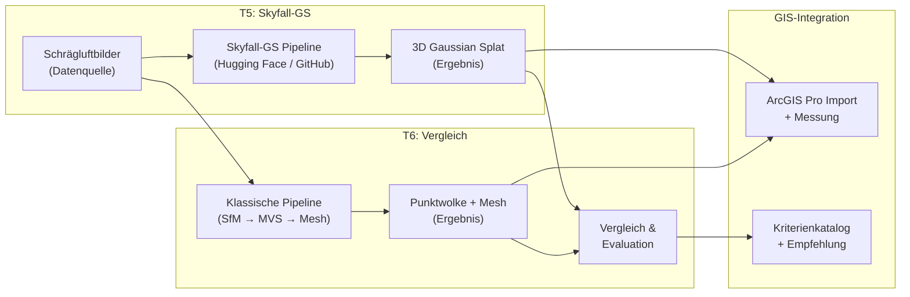
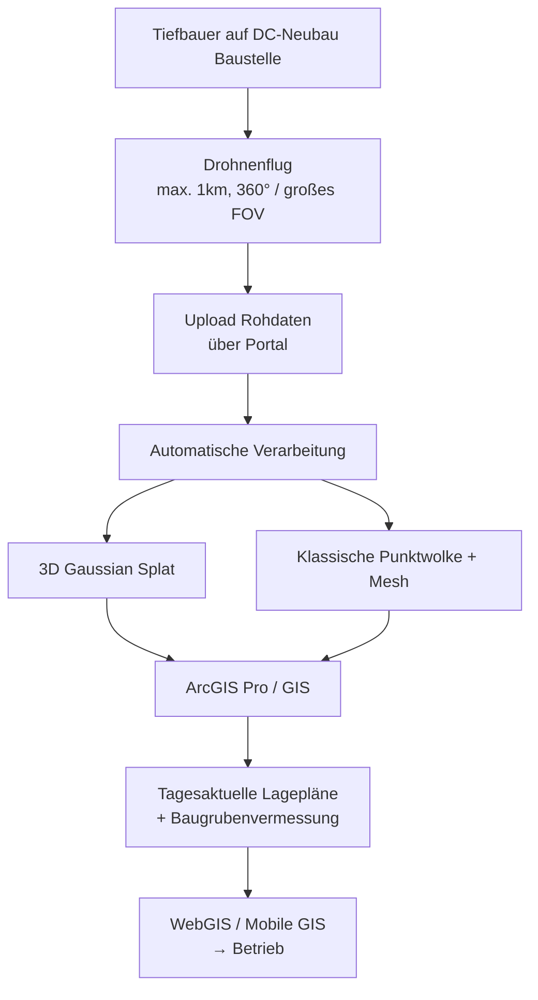

# Themenfindung & Scope-Entwicklung – Projektarbeit (PA)

> **Status:** Phase 3 – Konvergenz auf Hauptthema
> 
> Aktualisiert: 29.04.2026, 16:30 Uhr

---

## Warum T5 + T6 kombiniert werden sollten

Du hast genau recht gefragt. Hier die ausführliche Erklärung:

### T5 und T6 sind keine zwei separaten Themen – sie sind **zwei Seiten derselben Medaille**

| Aspekt | T5 alleine | T6 alleine | **T5 + T6 kombiniert** |
|---|---|---|---|
| **Fragestellung** | "Wie rekonstruiert man Würzburg in 3D aus Schrägluftbildern?" | "Was ist besser: 3DGS oder Punktwolke?" | **"Wie gut eignet sich 3DGS im Vergleich zur klassischen Photogrammetrie für die geodätische Nutzung von Schrägluftbildern?"** |
| **Datenbasis** | Schrägluftbilder Würzburg | Beliebige 3D-Daten | Schrägluftbilder (Würzburg ODER Drohne/TenneT) |
| **Methode** | Nur Skyfall-GS | Vergleich ohne spezifischen Use Case | Vergleich mit geodätischem Qualitätsanspruch |
| **Ergebnis** | 3D-Modell | Abstrakte Tabelle | **Handlungsempfehlung für die Praxis** |
| **Wissenschaft** | Eher anwendungsorientiert | Eher theoretisch | **Beides** |

**Fazit:** T5 liefert die **Datenbasis und den Use Case**, T6 liefert die **wissenschaftliche Methodik**. Zusammen ergibt sich ein vollständiges, rundes Thema.

---

## Das kombinierte Hauptthema

### Arbeitstitel (Entwurf)

> **"Evaluation von 3D Gaussian Splatting für die geodätische Baustellendokumentation – Ein Vergleich mit klassischer photogrammetrischer 3D-Rekonstruktion"**

oder kürzer / akademischer:

> **"3D Gaussian Splatting vs. Multi-View Stereo: Vergleichende Evaluation für geodätische Anwendungen am Beispiel drohnengestützter Schrägluftbilder"**

### Wie alle 5 Interessen abgedeckt werden

| Interesse | Abdeckung im Thema |
|---|---|
| 🌍 **Geoinformatik** | Georeferenzierung der 3D-Modelle, GIS-Integration (ArcGIS Pro GS-Import), Koordinatensysteme, Maßstabstreue |
| 🤖 **KI** | 3D Gaussian Splatting basiert auf differentiable rendering / ML-Optimierung. Optional: ML-basierte Objekterkennung auf den Modellen |
| 👁️ **Computer Vision** | Structure-from-Motion, Multi-View Stereo, Novel View Synthesis = Kern des Themas |
| 🛰️ **Fernerkundung** | Schrägluftaufnahmen (UAV oder Befliegung), Bildorientierung, Kamerakalibrierung |
| 💻 **Anwendungsentwicklung** | Pipeline-Entwicklung, GIS-Integration, ggf. Upload-Portal-Konzept (TenneT) |

### Der TenneT-Praxisbezug – Das Alleinstellungsmerkmal

> [!IMPORTANT]
> Die Verbindung zu TenneT macht dieses Thema **einzigartig** und hebt es von einer reinen akademischen Studie ab. Die Bewertungskriterien betonen "Kreativität" und "wirtschaftliches Denken" – genau das liefert der Praxisbezug.

**Für die PA relevant:**
- Der TenneT-Use-Case dient als **Motivationsrahmen** und **Praxisanforderungskatalog**
- Die PA definiert: Welche Genauigkeiten braucht TenneT? Welches Verfahren liefert sie? Zu welchem Aufwand?
- Die BA implementiert dann ggf. den Workflow / die Pipeline

**Für den Betreuer attraktiv:**
- Reale Industrieanwendung mit klarem Bedarf
- Nicht nur akademisch, sondern praxisnah
- Verbindung Drohne → 3D-Rekonstruktion → GIS = Kernkompetenz des Studienbereichs

---

## PA-BA-Split (Konzept → Realisierung)

### PA – "Konzeptionelle Evaluation" (15-25 Seiten, 4 Wochen netto)

| Kapitel | Inhalt | Seiten (ca.) |
|---|---|---|
| 1. Einleitung | Motivation (TenneT Use Case), Problemstellung, Zielsetzung, Abgrenzung | 2-3 |
| 2. Grundlagen | 2.1 Photogrammetrische 3D-Rekonstruktion (SfM, MVS, Mesh) | 3-4 |
| | 2.2 3D Gaussian Splatting (Theorie, Differenzierung zu NeRF) | |
| | 2.3 Geodätische Qualitätsanforderungen | |
| 3. Stand der Forschung | Existierende Vergleichsstudien, Forschungslücke identifizieren | 2-3 |
| 4. Methodik | 4.1 Kriterienkatalog (5 Dimensionen, siehe unten) | 4-5 |
| | 4.2 Versuchsdesign: Testdatensätze, Pipelines, Messverfahren | |
| | 4.3 GIS-Integrations-Konzept (ArcGIS Pro + Open Source) | |
| 5. Proof-of-Concept | Pilotversuch mit einem Testdatensatz (öffentlich oder eigene Drohne) | 3-4 |
| 6. Fazit & Ausblick BA | Zusammenfassung, Lessons Learned, konkreter BA-Plan | 2 |
| **Gesamt** | | **~18-22** |

#### Die 5 Evaluationsdimensionen (Kriterienkatalog)

| Dimension | Kriterien | Messmethode |
|---|---|---|
| **D1: Geometrische Genauigkeit** | RMSE, Hausdorff-Distanz, Maßstabstreue, Georeferenzierung | Vergleich mit Referenzdaten (Passpunkte, GNSS) |
| **D2: Visuelle Qualität** | PSNR, SSIM, LPIPS, subjektive Bewertung | Novel View Synthesis Metriken |
| **D3: Objekterkennbarkeit** | Manuelle Identifizierbarkeit von Objekten (Gebäude, Infrastruktur) | Nutzerstudie / Experteneinschätzung |
| **D4: ML-Objekterkennung** | Erkennungsrate von trainierten Modellen auf den 3D-Daten | YOLOv8 / Mask R-CNN auf gerenderten Views |
| **D5: Praxistauglichkeit** | Rechenzeit, Speicherbedarf, Skalierbarkeit, GIS-Import | Benchmarking auf Lab-Hardware |

> [!TIP]
> **"Symbiotische Nutzung"** (deine Idee aus der ursprünglichen Liste) wird als Querschnittsthema behandelt: Können beide Verfahren kombiniert werden? Z.B. Gaussian Splat für schnelle Visualisierung + Mesh für Messung?

### BA – "Durchführung & Praxisvalidierung" (40-80 Seiten, 10 Wochen netto)

- Vollständige Durchführung der Vergleichsstudie auf mehreren Datensätzen
- Ggf. mit Skyfall-GS Schrägluftbildern von Würzburg (falls Daten verfügbar)
- Praxistest mit TenneT-Drohnenaufnahmen von einer realen Baustelle
- Pipeline-Implementierung (Upload → Verarbeitung → GIS-Output)
- Quantitative + qualitative Auswertung aller 5 Dimensionen
- Handlungsempfehlung für die geodätische Praxis

---

## Datenstrategie – Kein Datenrisiko mehr

Das Schöne an dem kombinierten Thema: **Mehrere Datenquellen sind möglich**, wodurch das Risiko minimiert wird:

| Datenquelle | Verfügbarkeit | Für PA | Für BA |
|---|---|---|---|
| **Öffentliche Benchmark-Datensätze** (Tanks & Temples, MipNeRF360, etc.) | 🟢 Sofort verfügbar | ✅ PoC | ✅ Baseline |
| **Eigene Drohnenaufnahmen** (Campus/Testgebiet) | 🟢 Jederzeit machbar mit Uni-Drohne | ✅ Testdatensatz | ✅ Hauptdatensatz |
| **TenneT-Baustellendaten** | 🟡 Mit Arbeitgeber klären | ❌ | ✅ Praxisvalidierung |
| **Schrägluftbilder Würzburg** (über Dozent) | 🟠 Noch zu klären | ❌ | ✅ Optional / Bonus |

> [!NOTE]
> Für die PA brauchst du **nur die öffentlichen Benchmarks + ggf. eigene Drohnenaufnahmen**. Das ist sofort verfügbar. Die TenneT- und Würzburg-Daten wären ein Bonus für die BA.

---

## GIS-Integration – ArcGIS Pro & Open Source

Du hast erwähnt, dass ArcGIS Pro inzwischen GS importieren und Messungen durchführen kann. Das ist ein spannendes Teilthema:

### In der PA zu klären:
- Welche GIS-Software kann 3DGS importieren? (ArcGIS Pro, QGIS-Plugins?, Cesium?, Potree?)
- Welche Messungen sind auf GS-Daten im GIS möglich? (Punkt-zu-Punkt, Flächen, Volumen?)
- Wie genau sind diese Messungen im Vergleich zu Messungen auf klassischen Meshes/Punktwolken?
- Open-Source-Alternativen? (Three.js + GS-Viewer, Nerfstudio-Viewer, SuperSplat)

### In der BA zu implementieren:
- Vergleich der GIS-basierten Messung auf GS vs. Mesh
- Ggf. eigenes Plugin/Skript für die Integration

---

## Backup-Thema: T1 – 15-Minuten-Stadt

Falls T5+T6 aus irgendeinem Grund nicht funktioniert (z.B. Betreuer sieht es anders), bleibt **T1 (15-Minuten-Stadt)** als solides Backup:
- Sofort startbar (FOSS, keine Datenabhängigkeit)
- Wilkening als Betreuer
- Kopplung mit TenneT weniger naheliegend, aber gesellschaftlich relevant

---

## Zeitplan (aktualisiert)

### Diese Woche: Themenfindung finalisieren

| Tag | Datum | Aufgabe |
|---|---|---|
| ~~Tag 1-2~~ | ~~29.04.~~ | ~~Orientierung, Eliminierung~~ ✅ |
| **Tag 3** | **30.04.** | Tiefenrecherche: 5 Paper zu 3DGS + Photogrammetrie-Vergleich finden |
| **Tag 4** | **01.05.** | Skyfall-GS (HuggingFace/GitHub) testen, ArcGIS Pro GS-Import testen |
| **Tag 5** | **02.05.** | Scope-Definition finalisieren, Forschungsfragen formulieren |
| **Tag 6** | **03.05.** | Exposé schreiben (1-2 Seiten) |
| **Tag 7** | **04/05.05.** | E-Mail an Betreuer (Müller) + Dozent wegen Schrägluftbilder |

### Grober PA-Zeitplan (nach Anmeldung)

| Woche | Aufgabe |
|---|---|
| **W1** | Literaturreview + Grundlagen-Kapitel schreiben |
| **W2** | Kriterienkatalog entwickeln + Versuchsdesign |
| **W3** | Proof-of-Concept durchführen + GIS-Integration testen |
| **W4** | Ergebnisse auswerten, Fazit, Korrekturlesen, Abgabe |

---

## Nächste Schritte (Tag 3–4)

> [!IMPORTANT]
> **Morgen (Tag 3)** starten wir mit der Tiefenrecherche. Ich kann dir dabei helfen:
> 1. Relevante Paper zu 3DGS vs. Photogrammetrie finden und zusammenfassen
> 2. Die Skyfall-GS-Pipeline auf HuggingFace/GitHub analysieren
> 3. ArcGIS Pro GS-Import Möglichkeiten recherchieren

### Fragen zur Finalisierung:

1. **Gefällt dir der Arbeitstitel?** Oder möchtest du den Fokus anders setzen?
2. **Betreuer:** Soll es Prof. Müller werden (am besten für CV/3D) oder doch Wilkening (GIS-Schwerpunkt)? Oder Müller als Erst- und Wilkening als Zweitprüfer?
3. **TenneT-Kopplung:** Darf der Use Case in der PA erwähnt werden oder muss das mit TenneT abgesprochen werden (Sperrvermerk)?
4. **Soll ich morgen mit der Paper-Recherche starten?**
