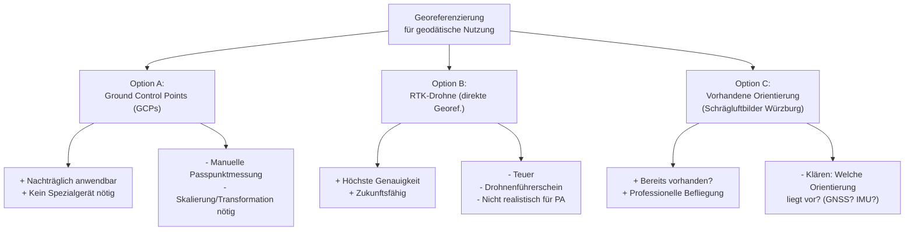

# Themenfindung & Scope-Entwicklung – Projektarbeit (PA)

> **Status:** Phase 3b – Scope-Verfeinerung + Recherchevorbereitung
> 
> Aktualisiert: 29.04.2026, 16:50 Uhr

---

## Aktualisierte Scope-Entscheidungen

### ✅ Bestätigt
- **Thema:** T5+T6 kombiniert (3D Gaussian Splatting vs. klassische Photogrammetrie)
- **Betreuer:** Müller (Erstprüfer) + Wilkening (Zweitprüfer)
- **PA-BA-Kopplung:** Ja (PA = Konzept, BA = Realisierung)
- **Alleinarbeit** (15-25 Seiten)

### 🔄 Geändert
- **TenneT:** Wird **nicht** in den formalen Scope geschrieben. Kann höchstens als Motivationsbeispiel in der Einleitung und als Ausblick in der BA erwähnt werden.
- **Datengrundlage primär:** Schrägluftbilder Würzburg (über Dozent) + öffentliche Benchmarks
- **Skyfall-GS:** Wird als spezialisierte 3DGS-Pipeline für Schrägluft-/Satellitenbilder untersucht (nicht als allgemeine 3DGS-Methode)

### ⚠️ Offene technische Entscheidungen

#### 1. Georeferenzierung – Der Knackpunkt

Dies ist die **zentrale methodische Herausforderung** und muss in der PA adressiert werden:



**Für die PA zu klären:**
- Welche Orientierungsdaten liegen bei den Würzburger Schrägluftbildern vor? (EXIF-GPS? Bildorientierung aus Aerotriangulation? GCPs?)
- Kann 3DGS mit bekannter Kameraorientierung initialisiert werden? (→ COLMAP-Vorkenntnisse?)
- Wie überträgt man die Georeferenzierung von der klassischen Pipeline auf den Gaussian Splat?

> [!IMPORTANT]
> Die Georeferenzierungsfrage ist ein **eigenständiger wissenschaftlicher Beitrag**. "Wie lässt sich ein 3D Gaussian Splat geodätisch referenzieren?" ist eine Forschungsfrage, die in der aktuellen Literatur **noch nicht befriedigend beantwortet** ist. Das macht deine Arbeit wertvoll!

#### 2. Level of Detail (LoD) / Aufnahmeentfernung

Muss noch nicht jetzt entschieden werden, aber in der PA als **Versuchsdesign-Parameter** definiert werden:

| LoD | Aufnahmeentfernung | Auflösung | Anwendung | Pipeline |
|---|---|---|---|---|
| **Stadtübersicht** | >200m (Befliegung) | ~5cm GSD | Stadtplanung, Übersicht | Skyfall-GS (optimiert dafür) |
| **Gebäudeebene** | 50-200m (UAV) | ~1-5cm GSD | Fassaden, Dachlandschaft | Skyfall-GS oder Standard 3DGS |
| **Objektebene** | <50m (UAV, nah) | <1cm GSD | Baugrube, Infrastruktur | Standard 3DGS (Nerfstudio etc.) |

→ In der PA: Alle LoDs konzeptionell beschreiben. Im PoC: **Einen** LoD exemplarisch durchführen.

---

## Aktualisierter Arbeitstitel (Entwurf)

Da TenneT raus ist und der Fokus auf Schrägluftbildern liegt:

> **"3D Gaussian Splatting für Schrägluftbilder – Vergleichende Evaluation mit klassischer photogrammetrischer 3D-Rekonstruktion unter geodätischen Qualitätsanforderungen"**

Oder kürzer:

> **"Evaluation von 3D Gaussian Splatting im Vergleich zur klassischen Photogrammetrie am Beispiel urbaner Schrägluftbilder"**

*→ Der Titel kann sich nach der Recherche noch ändern. Erstmal ein Arbeitstitel.*

---

## Aktualisierte PA-Gliederung

| Kap. | Inhalt | Seiten |
|---|---|---|
| 1 | **Einleitung:** Motivation (warum 3DGS für Geodäsie?), Problemstellung (Georeferenzierung!), Zielsetzung, Abgrenzung PA/BA | 2-3 |
| 2 | **Grundlagen:** 2.1 Photogrammetrische 3D-Rekonstruktion (SfM → MVS → Mesh), 2.2 3D Gaussian Splatting (Theorie, Differenzierung NeRF), 2.3 Skyfall-GS (Schrägluft-Optimierung), 2.4 Georeferenzierung in der Photogrammetrie | 4-5 |
| 3 | **Stand der Forschung:** Existierende Vergleichsstudien, Geo-Anwendungen von 3DGS, Forschungslücke | 3-4 |
| 4 | **Methodik:** 4.1 Kriterienkatalog (5 Dimensionen), 4.2 Versuchsdesign (Datensätze, LoD, Pipelines), 4.3 Georeferenzierungsansatz, 4.4 GIS-Integrationskonzept | 4-5 |
| 5 | **Proof-of-Concept:** Pilotversuch mit Benchmark-Datensatz, erste Ergebnisse | 3-4 |
| 6 | **Fazit & Ausblick:** Zusammenfassung, BA-Plan, Potenziale (u.a. Praxisanwendungen) | 1-2 |
| | **Gesamt** | **~18-23** |

---

## Recherche-Queries für Tag 3 (30.04.)

### Block 1: 3D Gaussian Splatting – Grundlagen & Vergleiche

#### Consensus AI / Scopus AI
```
How does 3D Gaussian Splatting compare to traditional photogrammetric 
reconstruction (Multi-View Stereo) in terms of geometric accuracy?
```
```
What are the limitations of 3D Gaussian Splatting for metric 
3D reconstruction and geospatial applications?
```
```
Can 3D Gaussian Splatting produce geometrically accurate 3D models 
comparable to point clouds from Structure-from-Motion pipelines?
```

#### Google Scholar
```
"3D Gaussian Splatting" AND ("photogrammetry" OR "multi-view stereo") AND "comparison"
```
```
"3D Gaussian Splatting" AND ("geometric accuracy" OR "metric evaluation" OR "RMSE")
```
```
"3DGS" AND ("point cloud" OR "mesh reconstruction") AND "evaluation"
```

#### Semantic Scholar (semanticscholar.org)
```
3D Gaussian Splatting geometric accuracy evaluation photogrammetry
```
```
Gaussian Splatting survey benchmark comparison 2024
```

---

### Block 2: Skyfall-GS & Schrägluftbilder

#### Consensus AI / Scopus AI
```
How can 3D Gaussian Splatting be applied to oblique aerial imagery 
for urban 3D reconstruction?
```
```
What methods exist for large-scale 3D Gaussian Splatting from 
aerial or satellite images?
```

#### Google Scholar
```
"Skyfall" AND "Gaussian Splatting" AND ("aerial" OR "oblique")
```
```
"Gaussian Splatting" AND ("aerial imagery" OR "oblique aerial" OR "UAV") AND "urban"
```
```
"Gaussian Splatting" AND ("satellite" OR "remote sensing" OR "large-scale")
```
```
"3DGS" AND ("city" OR "urban reconstruction") AND ("aerial" OR "drone")
```

#### Direkte Quellen (GitHub/HuggingFace)
- Skyfall-GS Repository: GitHub-Suche nach `skyfall gaussian splatting`
- HuggingFace: Suche nach `skyfall-gs` oder `aerial gaussian splatting`
- Papers With Code: Suche nach `3D Gaussian Splatting aerial`

---

### Block 3: Georeferenzierung von 3DGS / NeRF

#### Consensus AI / Scopus AI
```
How can Neural Radiance Fields or Gaussian Splats be georeferenced 
for geospatial applications?
```
```
What approaches exist for integrating 3D Gaussian Splatting with 
geographic coordinate systems and GIS?
```

#### Google Scholar
```
("Gaussian Splatting" OR "NeRF") AND ("georeferencing" OR "geospatial" OR "coordinate system")
```
```
("Gaussian Splatting" OR "NeRF") AND ("GIS" OR "geographic information system")
```
```
("3DGS" OR "neural radiance field") AND ("RTK" OR "GNSS" OR "ground control points") AND "accuracy"
```

> [!TIP]
> Dieses Themenfeld ist **noch sehr dünn besetzt** in der Literatur – das ist gleichzeitig die Forschungslücke und deine Chance auf einen originellen Beitrag!

---

### Block 4: Vergleichsstudien 3D-Rekonstruktion (allgemein)

#### Google Scholar
```
"3D reconstruction" AND "comparison" AND ("Gaussian Splatting" OR "NeRF") AND ("photogrammetry" OR "SfM")
```
```
"novel view synthesis" AND "3D reconstruction" AND "metric" AND "survey" AND 2024
```
```
"3D Gaussian Splatting" AND "benchmark" AND ("quality" OR "fidelity") AND 2024
```

#### Connected Papers (connectedpapers.com)
Starte mit dem Originalpaper als Seed:
```
3D Gaussian Splatting for Real-Time Radiance Field Rendering (Kerbl et al. 2023)
```
→ Zeigt dir den gesamten Zitationsgraph und verwandte Paper!

---

### Block 5: GIS-Integration von 3DGS

#### Google Scholar
```
"Gaussian Splatting" AND ("ArcGIS" OR "QGIS" OR "GIS integration" OR "geospatial visualization")
```
```
"3D Gaussian Splatting" AND ("point cloud" OR "LAS" OR "PLY") AND "export"
```
```
"Gaussian Splatting" AND ("Cesium" OR "3D Tiles" OR "web visualization" OR "digital twin")
```

#### Praxis-Quellen
- Esri Blog / ArcGIS Pro Dokumentation: Suche nach `Gaussian Splat` oder `3DGS` oder `splat import`
- QGIS Plugin Repository: Suche nach `gaussian` oder `splat` oder `nerf`
- Potree / Cesium Dokumentation: 3DGS-Support?

---

### Block 6: Photogrammetrie mit Schrägluftbildern (Baseline)

#### Google Scholar
```
"oblique aerial imagery" AND "3D reconstruction" AND ("urban" OR "city model") AND "accuracy"
```
```
"oblique photogrammetry" AND ("mesh" OR "point cloud") AND ("quality" OR "evaluation")
```
```
"Structure from Motion" AND "oblique" AND ("aerial" OR "UAV") AND "urban" AND "comparison"
```

---

## Recherche-Workflow für morgen

| Schritt | Tool | Dauer | Ziel |
|---|---|---|---|
| 1 | **Connected Papers** | 30 min | Zitationsgraph ab Kerbl et al. 2023 → Überblick über das Feld |
| 2 | **Google Scholar** | 60 min | Block 1 + Block 2 Queries → 10-15 relevante Paper sammeln |
| 3 | **Consensus AI** | 45 min | Block 3 (Georeferenzierung) → Forschungslücke bestätigen |
| 4 | **GitHub/HuggingFace** | 30 min | Skyfall-GS analysieren, verfügbare Pipelines sichten |
| 5 | **Scopus AI** | 30 min | Block 4 + 5 → GIS-Integration + Vergleichsstudien |
| 6 | **Esri/QGIS Docs** | 30 min | Block 5 → Praxis-Stand der GIS-Integration |

**Gesamtzeit: ~3.5-4h**

Nach der Recherche: Ergebnisse strukturiert festhalten und wir bewerten gemeinsam, ob das Thema so haltbar ist und wo die exakte Forschungslücke liegt.

---

## Nächste Schritte

- [ ] **Morgen (30.04.):** Recherche durchführen mit obigen Queries
- [ ] **Dozent kontaktieren:** Frage zu den Schrägluftbildern Würzburg (Verfügbarkeit, Orientierungsdaten, Nutzungsbedingungen)
- [ ] **Skyfall-GS testen:** Repository klonen, Dokumentation lesen, ggf. mit Beispieldaten testen
- [ ] **Nach der Recherche:** Ergebnisse hier teilen → wir verfeinern Forschungsfrage + Scope
